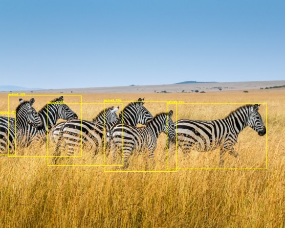

# Animal-Detector
- Detect Animals present in given image/video frame.
- Python >= 3.8
- Input image size = 800 x 800

---

---

### Setup

1. Clone this repo
2. Navigate to Animal-Detector directory
3. pip install -r requirements.txt
4. Run 01-Inference notebook

---